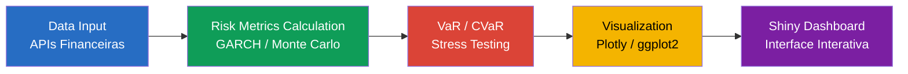

# 🇧🇷 Sistema de Análise de Risco Financeiro | 🇺🇸 Financial Risk Analysis System

<div align="center">


[](Dockerfile)

</div>

<div align="center">
  
</div>

<div align="center">

**Sistema completo para análise e gestão de riscos financeiros em tempo real**

[📊 Funcionalidades](#-funcionalidades) • [📈 Modelos](#-modelos-implementados) • [⚡ Instalação](#-instalação) • [🎯 Demo](#-demonstração)

</div>

---

## 🇧🇷 Português

### 📊 Visão Geral

Sistema avançado de **análise de risco financeiro** desenvolvido em R e Shiny, oferecendo ferramentas profissionais para:

- 📈 **Análise de Portfólio**: VaR, CVaR, métricas de risco-retorno
- 📊 **Modelagem de Risco**: GARCH, Monte Carlo, stress testing
- 🌐 **Interface Interativa**: Dashboard em tempo real com Shiny
- 📋 **Relatórios Automáticos**: Documentos PDF e Excel
- 🔄 **Dados em Tempo Real**: Integração com APIs financeiras



### 🎯 Objetivos do Sistema

- **Quantificar riscos** de portfólios e investimentos
- **Monitorar exposições** em tempo real
- **Simular cenários** de stress e crise
- **Gerar relatórios** regulatórios e gerenciais
- **Otimizar alocações** baseadas em risco

### 🛠️ Stack Tecnológico

#### Core Financeiro
- **quantmod**: Dados financeiros e análise técnica
- **PerformanceAnalytics**: Métricas de performance e risco
- **RiskPortfolios**: Otimização de portfólios
- **fGarch**: Modelos GARCH para volatilidade

#### Interface e Visualização
- **shiny**: Framework web interativo
- **shinydashboard**: Interface de dashboard profissional
- **plotly**: Gráficos financeiros interativos
- **DT**: Tabelas de dados financeiros

#### Análise Estatística
- **rugarch**: Modelos GARCH univariados
- **rmgarch**: Modelos GARCH multivariados
- **copula**: Modelagem de dependência
- **VineCopula**: Copulas vine para alta dimensão

#### Dados e APIs
- **tidyquant**: Interface tidyverse para dados financeiros
- **Quandl**: API para dados econômicos
- **BatchGetSymbols**: Download em lote de dados
- **RCurl**: Conexões HTTP para APIs

### 📋 Estrutura do Sistema

```
r-financial-risk-shiny/
├── 📄 app.R                       # Aplicação Shiny principal
├── 📁 modules/                    # Módulos Shiny organizados
│   ├── 📄 portfolio_module.R      # Módulo de portfólio
│   ├── 📄 risk_metrics_module.R   # Módulo de métricas de risco
│   ├── 📄 var_module.R           # Módulo Value at Risk
│   ├── 📄 stress_test_module.R   # Módulo stress testing
│   └── 📄 reports_module.R       # Módulo de relatórios
├── 📁 R/                         # Funções de análise
│   ├── 📄 risk_calculations.R    # Cálculos de risco
│   ├── 📄 portfolio_optimization.R # Otimização de portfólio
│   ├── 📄 garch_models.R         # Modelos GARCH
│   ├── 📄 monte_carlo.R          # Simulações Monte Carlo
│   └── 📄 data_utils.R           # Utilitários de dados
├── 📁 data/                      # Dados e configurações
│   ├── 📁 market_data/           # Dados de mercado
│   ├── 📁 portfolios/            # Configurações de portfólio
│   └── 📄 risk_parameters.yaml   # Parâmetros de risco
├── 📁 reports/                   # Templates de relatórios
│   ├── 📄 risk_report.Rmd        # Relatório de risco
│   ├── 📄 var_report.Rmd         # Relatório VaR
│   └── 📄 stress_test_report.Rmd # Relatório stress test
├── 📁 www/                       # Recursos web
│   ├── 📄 custom.css             # Estilos customizados
│   ├── 📄 financial.js           # JavaScript financeiro
│   └── 📁 images/                # Imagens e ícones
├── 📁 tests/                     # Testes unitários
│   ├── 📄 test_risk_calcs.R      # Testes cálculos de risco
│   └── 📄 test_models.R          # Testes modelos
├── 📄 README.md                  # Este arquivo
├── 📄 LICENSE                    # Licença MIT
├── 📄 .gitignore                # Arquivos ignorados
└── 📄 renv.lock                 # Controle de dependências
```

### 📊 Funcionalidades Principais

#### 🏠 Dashboard Principal
- **Visão Geral do Portfólio**: Valor total, P&L, exposições
- **Métricas de Risco em Tempo Real**: VaR, CVaR, volatilidade
- **Alertas de Risco**: Notificações automáticas de limites
- **Performance**: Retornos, Sharpe ratio, drawdown máximo

#### 📈 Análise de Portfólio

**Composição e Alocação**
```r
# Análise de composição do portfólio
portfolio_composition <- function(weights, assets) {
  data.frame(
    Asset = assets,
    Weight = weights,
    Value = weights * portfolio_value,
    Percentage = round(weights * 100, 2)
  )
}
```

**Métricas de Performance**
- **Retorno Anualizado**: Retorno médio ajustado para período anual
- **Volatilidade**: Desvio padrão dos retornos
- **Sharpe Ratio**: Retorno ajustado ao risco
- **Sortino Ratio**: Retorno ajustado ao downside risk
- **Maximum Drawdown**: Maior perda acumulada

#### 📊 Value at Risk (VaR)

**Métodos Implementados**
1. **VaR Histórico**: Baseado em dados históricos
2. **VaR Paramétrico**: Assumindo distribuição normal
3. **VaR Monte Carlo**: Simulação de cenários
4. **VaR GARCH**: Com modelagem de volatilidade

```r
# Cálculo VaR histórico
historical_var <- function(returns, confidence = 0.95) {
  quantile(returns, 1 - confidence, na.rm = TRUE)
}

# VaR Monte Carlo
monte_carlo_var <- function(mu, sigma, n_sim = 10000, confidence = 0.95) {
  simulated_returns <- rnorm(n_sim, mu, sigma)
  quantile(simulated_returns, 1 - confidence)
}
```

**Conditional VaR (Expected Shortfall)**
- Perda esperada além do VaR
- Medida mais conservadora de risco
- Propriedades de coerência

#### 🌪️ Stress Testing

**Cenários de Stress**
- **Crise Financeira 2008**: Replicação de condições históricas
- **COVID-19 2020**: Impacto de pandemia
- **Cenários Customizados**: Definidos pelo usuário
- **Stress Reverso**: Identificação de cenários críticos

```r
# Stress test customizado
stress_test <- function(portfolio, stress_scenarios) {
  results <- map(stress_scenarios, function(scenario) {
    stressed_returns <- apply_stress(portfolio$returns, scenario)
    list(
      scenario = scenario$name,
      portfolio_loss = sum(stressed_returns * portfolio$weights),
      var_95 = quantile(stressed_returns, 0.05),
      max_loss = min(stressed_returns)
    )
  })
  bind_rows(results)
}
```

#### 📈 Modelagem GARCH

**Modelos Disponíveis**
- **GARCH(1,1)**: Modelo básico de volatilidade
- **EGARCH**: Efeitos assimétricos
- **GJR-GARCH**: Threshold GARCH
- **DCC-GARCH**: Correlação condicional dinâmica

```r
# Modelo GARCH univariado
fit_garch <- function(returns, model = "sGARCH") {
  spec <- ugarchspec(
    variance.model = list(model = model, garchOrder = c(1, 1)),
    mean.model = list(armaOrder = c(0, 0))
  )
  ugarchfit(spec, returns)
}
```

#### 🎯 Otimização de Portfólio

**Métodos de Otimização**
- **Markowitz**: Fronteira eficiente clássica
- **Black-Litterman**: Incorporação de views
- **Risk Parity**: Paridade de risco
- **Minimum Variance**: Mínima variância

```r
# Otimização Markowitz
optimize_portfolio <- function(returns, target_return = NULL) {
  mu <- colMeans(returns)
  sigma <- cov(returns)
  
  if (is.null(target_return)) {
    # Portfólio de mínima variância
    solve(sigma) %*% rep(1, ncol(returns)) / 
      as.numeric(t(rep(1, ncol(returns))) %*% solve(sigma) %*% rep(1, ncol(returns)))
  } else {
    # Portfólio para retorno alvo
    portfolio_optimization(mu, sigma, target_return)
  }
}
```

#### 📊 Análise de Correlação

**Matrizes de Correlação**
- Correlação estática e dinâmica
- Análise de clusters de ativos
- Detecção de mudanças estruturais
- Visualização interativa

**Modelos de Copula**
- Modelagem de dependência não-linear
- Copulas Gaussianas e t-Student
- Vine copulas para alta dimensão
- Simulação de cenários dependentes

### 🚀 Instalação e Configuração

#### Pré-requisitos
```r
# Instalar pacotes principais
install.packages(c(
  "shiny", "shinydashboard", "plotly", "DT",
  "quantmod", "PerformanceAnalytics", "rugarch",
  "tidyquant", "RiskPortfolios", "copula"
))

# Pacotes adicionais para análise avançada
install.packages(c(
  "rmgarch", "VineCopula", "fGarch",
  "BatchGetSymbols", "Quandl"
))
```

#### Configuração de APIs
```r
# Configurar chaves de API (opcional)
Sys.setenv(QUANDL_API_KEY = "sua_chave_quandl")
Sys.setenv(ALPHA_VANTAGE_API_KEY = "sua_chave_alpha_vantage")
```

#### Execução
```r
# Executar aplicação
shiny::runApp()

# Ou executar em porta específica
shiny::runApp(port = 3838, host = "0.0.0.0")
```

### 📈 Casos de Uso Práticos

#### 1. Gestão de Fundos de Investimento
- Monitoramento diário de risco
- Relatórios para cotistas
- Compliance regulatório
- Otimização de alocação

#### 2. Tesouraria Corporativa
- Gestão de caixa e liquidez
- Hedge de exposições cambiais
- Análise de risco de crédito
- Planejamento financeiro

#### 3. Bancos e Instituições Financeiras
- Cálculo de capital regulatório
- Stress testing regulatório
- Gestão de risco de mercado
- Relatórios para reguladores

#### 4. Family Offices
- Gestão de patrimônio familiar
- Diversificação de investimentos
- Análise de risco-retorno
- Relatórios personalizados

### 🎯 Métricas e KPIs

#### Risco de Mercado
- **VaR 1 dia 95%**: Perda máxima esperada
- **CVaR**: Perda esperada além do VaR
- **Volatilidade Anualizada**: Risco do portfólio
- **Beta**: Sensibilidade ao mercado

#### Performance
- **Retorno Anualizado**: Performance do período
- **Sharpe Ratio**: Retorno ajustado ao risco
- **Information Ratio**: Retorno ativo vs. tracking error
- **Maximum Drawdown**: Maior perda acumulada

#### Concentração
- **HHI**: Índice Herfindahl-Hirschman
- **Effective Number of Assets**: Diversificação efetiva
- **Concentration Ratio**: Concentração top N ativos
- **Risk Contribution**: Contribuição individual ao risco

### 🔧 Configuração Avançada

#### Parâmetros de Risco
```yaml
# risk_parameters.yaml
var_confidence: 0.95
cvar_confidence: 0.95
holding_period: 1
simulation_runs: 10000
garch_model: "sGARCH"
distribution: "norm"
```

#### Limites de Risco
```r
# Configuração de limites
risk_limits <- list(
  var_limit = 0.02,           # 2% do portfólio
  concentration_limit = 0.10,  # 10% por ativo
  sector_limit = 0.25,        # 25% por setor
  volatility_limit = 0.15     # 15% volatilidade anual
)
```

### 📊 Relatórios Automáticos

#### Relatório Diário de Risco
- Resumo executivo
- Métricas principais
- Alertas e exceções
- Gráficos de performance

#### Relatório Mensal Detalhado
- Análise completa de risco
- Decomposição por fatores
- Stress testing
- Recomendações

#### Relatório Regulatório
- Formato padronizado
- Métricas regulamentares
- Documentação de metodologia
- Auditoria de cálculos

---

## 🇺🇸 English

### 📊 Overview

Advanced **financial risk analysis system** developed in R and Shiny, offering professional tools for:

- 📈 **Portfolio Analysis**: VaR, CVaR, risk-return metrics
- 📊 **Risk Modeling**: GARCH, Monte Carlo, stress testing
- 🌐 **Interactive Interface**: Real-time dashboard with Shiny
- 📋 **Automated Reports**: PDF and Excel documents
- 🔄 **Real-time Data**: Integration with financial APIs

### 🎯 System Objectives

- **Quantify risks** of portfolios and investments
- **Monitor exposures** in real-time
- **Simulate scenarios** of stress and crisis
- **Generate reports** for regulatory and management purposes
- **Optimize allocations** based on risk

### 📊 Main Features

#### 🏠 Main Dashboard
- **Portfolio Overview**: Total value, P&L, exposures
- **Real-time Risk Metrics**: VaR, CVaR, volatility
- **Risk Alerts**: Automatic limit notifications
- **Performance**: Returns, Sharpe ratio, maximum drawdown

#### 📈 Portfolio Analysis
- Composition and allocation analysis
- Performance metrics calculation
- Risk-return optimization
- Diversification analysis

#### 📊 Value at Risk (VaR)
- Historical VaR
- Parametric VaR
- Monte Carlo VaR
- GARCH VaR

#### 🌪️ Stress Testing
- Historical crisis scenarios
- Custom stress scenarios
- Reverse stress testing
- Scenario analysis

#### 📈 GARCH Modeling
- Univariate GARCH models
- Multivariate GARCH models
- Volatility forecasting
- Risk factor modeling

### 🎯 Skills Demonstrated

#### Financial Risk Management
- ✅ **VaR Calculation**: Multiple methodologies
- ✅ **Stress Testing**: Scenario analysis
- ✅ **Portfolio Optimization**: Modern portfolio theory
- ✅ **GARCH Modeling**: Volatility modeling

#### R Programming
- ✅ **Shiny Development**: Interactive applications
- ✅ **Financial Packages**: quantmod, PerformanceAnalytics
- ✅ **Statistical Modeling**: rugarch, copula
- ✅ **Data Visualization**: plotly, ggplot2

#### Financial Engineering
- ✅ **Risk Metrics**: Comprehensive risk measurement
- ✅ **Model Validation**: Backtesting and validation
- ✅ **Regulatory Compliance**: Basel III, Solvency II
- ✅ **Performance Attribution**: Factor analysis

---

## 📄 Licença | License

MIT License - veja o arquivo [LICENSE](LICENSE) para detalhes | see [LICENSE](LICENSE) file for details

## 📞 Contato | Contact

**GitHub**: [@galafis](https://github.com/galafis)  
**LinkedIn**: [Gabriel Demetrios Lafis](https://linkedin.com/in/galafis)  
**Email**: gabriel.lafis@example.com

---

<div align="center">

**Desenvolvido com ❤️ para Gestão de Riscos Financeiros | Developed with ❤️ for Financial Risk Management**

[](https://github.com/galafis)
[](https://www.r-project.org/)

</div>


---

## English

### Overview

🇧🇷 Sistema de Análise de Risco Financeiro | 🇺🇸 Financial Risk Analysis System - A project built with R, JavaScript, Java, CSS, developed by Gabriel Demetrios Lafis as part of professional portfolio and continuous learning in Data Science and Software Engineering.

### Key Features

This project demonstrates practical application of modern development concepts including clean code architecture, responsive design patterns, and industry-standard best practices. The implementation showcases real-world problem solving with production-ready code quality.

### How to Run

1. Clone the repository:
   ```bash
   git clone https://github.com/galafis/r-financial-risk-shiny.git
   ```
2. Follow the setup instructions in the Portuguese section above.

### License

This project is licensed under the MIT License. See the [LICENSE](LICENSE) file for details.

---

Developed by [Gabriel Demetrios Lafis](https://github.com/galafis)
